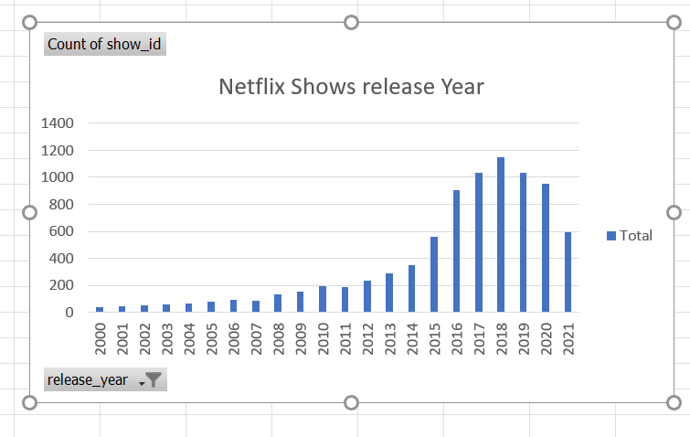

# Map-Reduce
- Learning the basics of ***MapReduce*** for large datasets in ***Python***.

## Data Description:
- This Data Set consists details of all the ***Movies and TV Shows, available in Netflix***, like their names, release year, duration etc...
- The Dataset is a free resource from ***[Kaggle](https://www.kaggle.com)*** and can be viewed ***[here](netflix_titles.csv)***.

## Study:
- For this Dataset, I want to find out the total count of Movies and TV Shows, Netflix has released each year.

## Execution:
- A ***Mapper Script*** extracts the year from each row in the dataset, which is used as a ***Key*** and a ***Value*** of 1 is assigned to each Key. This is given as input to the ***Sorter*** which sorts all the years in descending order. Based on the output of the Sorter, which is passed as input to the ***Reducer Script***, combines all the similar years and increments the count.

## Powershell Command:
- ***cat netflix_titles.csv | python 21mapper.py | python 22sorter.py | python 23reducer.py > output.txt***

## Summary:
- By examining the final output, we can understand the ***growth of Netflix*** in recent years, due to improvements in the Technology and access to Internet. More the ***80%*** of Netflix content was released in the last ***5 years***.

&nbsp;&nbsp;&nbsp;&nbsp;&nbsp;&nbsp;&nbsp;&nbsp;&nbsp;&nbsp;&nbsp;&nbsp;&nbsp;&nbsp;&nbsp;&nbsp;&nbsp;&nbsp;&nbsp;&nbsp;&nbsp;&nbsp;&nbsp;&nbsp;&nbsp;&nbsp;&nbsp;&nbsp;&nbsp;&nbsp;&nbsp;&nbsp; 
